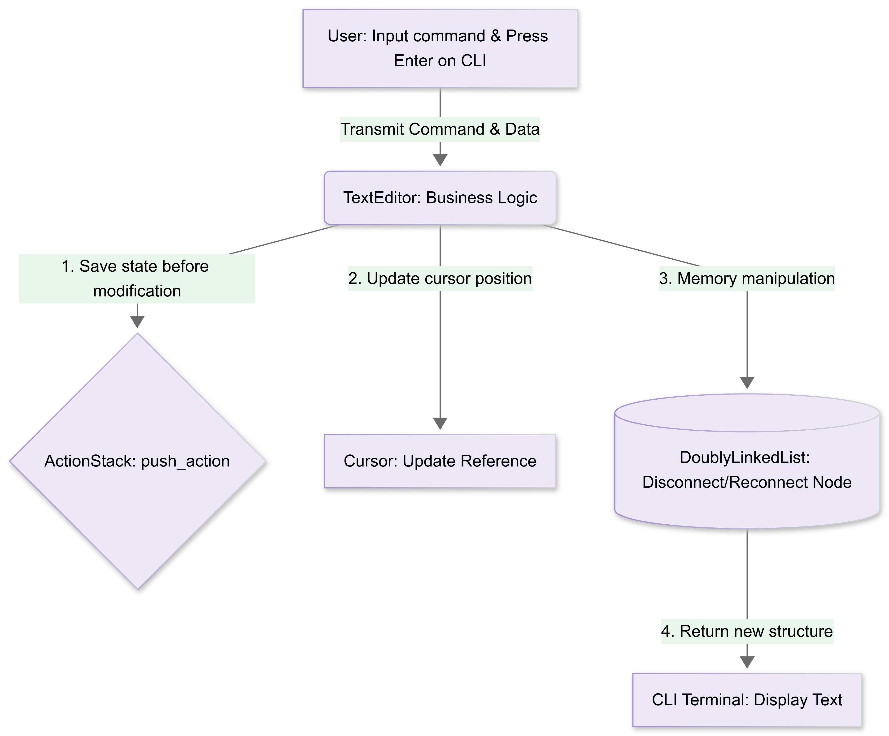
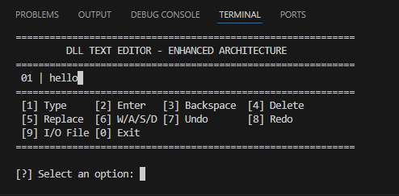
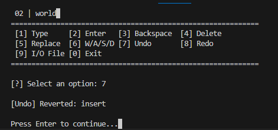
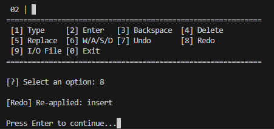
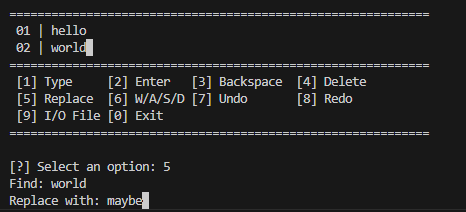
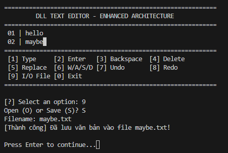

# DSA_Group2_Topic4 
# 📝 Text Editor using Doubly Linked List Develop a simple text editor where each character/line is a node in a doubly linked list. Support features: undo/redo, cursor movement, find & replace.

## 👥 Group Members
* **Member 1: Nguyễn Thị Đoan Trang_11245941** Node, DoublyLinkedList
* **Member 2: Phạm Anh Thơ_11245934** Cursor 
* **Member 3: Nguyễn Nam Huy_11245880** Insert/Delete
* **Member 4: Nguyễn Đình Khải_11245883** Find & Replace
* **Member 5: Trần Trúc Quỳnh_11245929** Undo/Redo using Stack
# 📑 Phase 1: System Architecture & Specification

## 🎯 Project Objectives
* Develop a lightweight, robust text editor operating entirely within the command-line interface (CLI) environment.
* Implement and optimize fundamental data structures—specifically a custom **Doubly Linked List** and an **Action Stack**—to handle real-time text manipulation.
* Adhere strictly to Object-Oriented Programming (OOP) principles, ensuring a clean Separation of Concerns between data storage, logical operations, and the user interface.

## 📌 System Requirements
The software architecture is engineered to satisfy the following technical specifications:
* **Memory Management:** Each individual line of text is encapsulated within a unique `Node` inside a Doubly Linked List structure to guarantee $O(1)$ structural mutations.
* **Functional Modules:**
  1. **File I/O Engine:** Streams data from external `.txt` files directly into the data structure and safely commits modifications back to disk.
  2. **Cursor Navigation Module:** Maintains an active pointer to allow free traversal (Up, Down, Left, Right) through lines and string offsets.
  3. **Text Manipulation Engine:** Supports precise string mutations, line insertions, and node deletions at the active cursor boundary.
  4. **Search & Replace Subsystem:** Executes pattern matching across the document topology to locate and substitute targeted text queries.
  5. **Transaction Ledger (Undo/Redo):** Records state transitions into a LIFO (Last-In-First-Out) Stack to guarantee safe state recovery.

## 🏗️ System Architecture
The structural layout relies on a decoupled, modular design. The UML Class Diagram below details the explicit attributes, methods, composition closures, and behavioral dependencies governing the system components.

# 📑 Phase 2: Operational Data Flow & Cursor Navigation

## 🌊 System Data Flow
The operational data flow diagram below illustrates the journey of a UI command through our decoupled architecture, ensuring $O(1)$ performance for structural mutations.

## 🔄 The Data Flow Pipeline
The system architecture is strictly optimized for a modern **Web GUI** environment. Every user interaction (e.g., clicking a button or selecting a dropdown option) triggers a strict, unidirectional 4-step execution pipeline to guarantee data integrity:
1. **Save state before modification:** The current state is securely pushed to the `ActionStack` prior to any structural modification.
2. **Update cursor position:** The `Cursor` calculates the exact reference `Node` and column index.
3. **Memory manipulation:** The `DoublyLinkedList` executes safe pointer disconnections and reconnections at the physical data layer.
4. **Return new structure:** The newly updated structure is returned and rendered dynamically on the Web GUI.

## 🧭 Cursor Movement Mechanics
Unlike traditional static arrays, the cursor is implemented as a live object maintaining a direct memory reference to a specific `Node` (representing a line of text).
* **Vertical Traversal (Up/Down):** Traverses the text layout sequentially by shifting the pointer reference through prev and next properties.
* **Horizontal Traversal (Left/Right):** Increments or decrements a local integer variable called col_index within the boundaries of the active node's string data.

## 🛡️ Memory Safety & Edge Case Handling
To ensure absolute system stability and prevent **'Out-of-bounds'** exceptions (`NullPointer` / `IndexError`) during rapid Web GUI inputs, the navigation algorithm implements dual-layer protections:
* **Null Pointer Safeguards:** Strictly validates adjacent nodes before executing any vertical transition, blocking invalid memory jumps at the head or tail of the document.
* **Dynamic Snap Alignment:** Employs a mathematical bounding function—`min(col_index, len(current_node.data))`—to automatically snap the horizontal coordinate to the safe boundary when the cursor jumps between lines of asymmetric lengths.

To help you draft a high-quality README section for **Phase 3**, I have structured this briefing to highlight your technical implementations and the logic behind your text editor's core functionality.

Since you are managing a data science/data-heavy project, this section emphasizes the efficiency of your approach.

### **Phase 3: Core Editing Operations**

#### **Overview**

Phase 3 focuses on the implementation of core text-editing operations, transforming the document from a static data structure into an interactive environment. This phase prioritizes efficient node manipulation and string processing within the linked-list architecture.

#### **Key Functionalities**

The `InsertAndDelete` class manages the state of the document based on cursor interaction:

* **`Insert_at_cursor`**: Enables real-time text injection by splitting the current string at the `col_index`, inserting the new content, and re-joining the fragments.
* **`Backspace_key`**: Handles backward deletion. It supports standard character deletion and cross-node line merging, effectively managing the document's link structure when the cursor is at the beginning of a line.
* **`forward_delete`**: Manages forward deletion. This function mirrors the backward logic but intelligently handles line-pulling, merging the next node's data into the current one when the cursor reaches the end of a line.
* **`Enter_key`**: Implements line breaks by splitting the current node's data at the cursor position and creating a new node in the linked list, followed by a cursor reset to the new line.

#### **Technical Performance**

The operations in this phase are optimized for a linked-list structure where individual line manipulation is performed in linear time:

| Operation | Complexity | Note |
| --- | --- | --- |
| **Insert/Split/Merge** | $O(n)$ | Performance scales linearly with the length of the strings being processed ($n$). |
| **Node Traversal** | $O(1)$ | Linked list pointer updates are constant time, ensuring efficient document restructuring. |

## 🔍 Find & Replace Architecture

The `FindAndReplace` class operates as an independent subsystem,
traversing the Doubly Linked List to locate and substitute text
patterns without modifying the DLL's pointer structure.

## 🔎 Find Algorithm: Sequential Traversal

The `find()` method performs a full sequential scan across every
node in the document, collecting all match coordinates before
returning.

**Traversal Logic:**
1. Initialize traversal at `document.head`
2. For each node, scan `current.data` using an advancing offset,
   catching **multiple occurrences per line**
3. Record each match as `{ node, line, col_start, col_end, context }`
4. Advance to `current.next` until `None`, return full results list

## ✂️ Replace Algorithm: Pointer Splice

Rather than deleting and recreating nodes, replacement is performed
entirely **inside `node.data`**, leaving `prev` and `next` pointers
completely untouched. The current line is split into three parts:
`left` (before the keyword), the `keyword` itself (discarded), and
`right` (after the keyword). These are then rejoined with `new_text`
in the middle and written back into the node.

Two replacement modes are supported:

| Method | Behavior | Use Case |
|---|---|---|
| `replace_first()` | Replaces the first match only | Targeted replacement |
| `replace_all()` | Single pass through every node | Global substitution |

## ⚡ Technical Performance

| Operation | Complexity | Note |
|---|---|---|
| **find()** | O(n × m) | n = lines, m = avg line length |
| **replace_first()** | O(n × m) + O(k) | O(k) for the splice, k = line length |
| **replace_all()** | O(n × m) | Single pass per node |
| **DLL pointer work** | O(1) | prev/next never modified during replace |

## 🛡️ Memory Management

Since Python strings are immutable, assigning a new string to
`node.data` orphans the old string object. Python's Garbage
Collector automatically reclaims it, ensuring **zero memory
leakage** even when replacing thousands of occurrences across
a large document.

# 📑 Phase 5: Undo/Redo Architecture & System Integration

## 🔁 Hybrid Undo/Redo Architecture
The Undo/Redo subsystem is designed using a hybrid recovery strategy to balance memory efficiency and state consistency during document mutations.

* **⚙️ Command Pattern for Lightweight Operations:** For incremental text operations (character insertion, backspace, forward delete, enter key), the system stores only the affected node reference, cursor position, and modified text fragment. This minimizes memory overhead while allowing fast rollback execution.
* **📸 Snapshot (Memento) Strategy for Structural Mutations:** For large-scale transformations such as **Replace All**, the system captures a full snapshot containing the complete document state, cursor line position, and cursor column index. This guarantees safe restoration even when multiple nodes are reconstructed.
* **🧠 Cursor State Preservation:** A dedicated recovery mechanism restores the active node reference and horizontal cursor alignment after Undo/Redo execution to prevent cursor desynchronization.
* **♻️ Memory Reclamation:** During snapshot restoration, outdated disconnected nodes become orphan objects. These objects are automatically reclaimed by Python's built-in Garbage Collector, preventing persistent memory leakage.

## 🔗 System Integration Layer
* **🏛️ Centralized Orchestration:** The `main.py` module functions as the central orchestration layer. It coordinates interactions between `DoublyLinkedList`, `Cursor`, `InsertAndDelete`, `FindAndReplace`, and `ActionStack`, enforcing strong Separation of Concerns (SoC).
* **🧩 Dependency Injection Strategy:** The editor initializes independent modules and injects shared references (`document`, `cursor`) into operational subsystems, improving maintainability, testing flexibility, and reducing component coupling.
* **🛡️ Stability & Exception Handling:** To improve runtime reliability, the integration layer includes protected `try/except` execution blocks, terminal recovery fallback, safe screen clearing for IDEs, and emergency interruption handling (`KeyboardInterrupt`).

## 📸 Phase 4: System Demonstration

Here are visual demonstrations of the Text Editor's core functionalities executing directly within the terminal environment.

## 1️⃣ Main Command-Line Interface

## 2️⃣ State Recovery (Undo & Redo)

**Undo Execution:**

**Redo Execution:**

## 3️⃣ Snapshot Restoration (Replace All)

## 4️⃣ File I/O Engine (Save to Disk)

