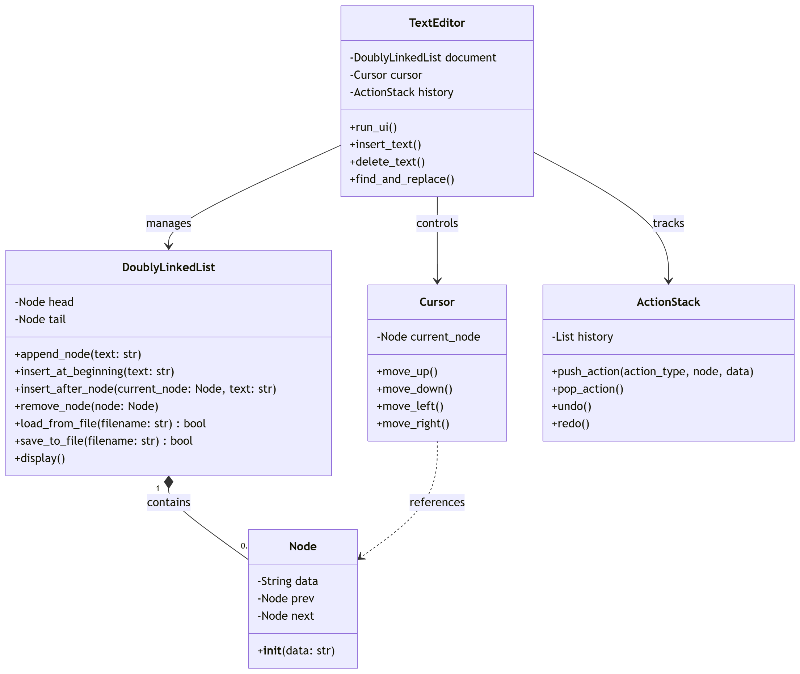

# DSA_Group2_Topic4 
# 📝 Text Editor using Doubly Linked List Develop a simple text editor where each character/line is a node in a doubly linked list. Support features: undo/redo, cursor movement, find & replace.

## 👥 Thành viên nhóm 2 và Phân công công việc
* **Thành viên 1:Nguyễn Thị Đoan Trang_11245941** Xây dựng cấu trúc cốt lõi (Node, DoublyLinkedList) và hệ thống Đọc/Ghi file (File I/O).
* **Thành viên 2:Phạm Anh Thơ_11245934** Xử lý logic di chuyển con trỏ (Cursor - Lên, Xuống, Trái, Phải).
* **Thành viên 3:Nguyễn Nam Huy_11245880** Xử lý logic Thêm/Xóa văn bản (Insert/Delete).
* **Thành viên 4:Nguyễn Đình Khải_11245883** Tính năng Tìm kiếm và Thay thế (Find & Replace).
* **Thành viên 5:Trần Trúc Quỳnh_11245929** Quản lý lịch sử thao tác (Undo/Redo bằng Stack) và dựng Giao diện Menu (UI).
# 📑 Phase 1: System Architecture & Specification

## 🎯 Project Objectives
* Develop a lightweight, robust text editor operating entirely within the command-line interface (CLI) environment.
* Implement and optimize fundamental data structures—specifically a custom **Doubly Linked List** and an **Action Stack**—to handle real-time text manipulation.
* Adhere strictly to Object-Oriented Programming (OOP) principles, ensuring a clean Separation of Concerns between data storage, logical operations, and the user interface.

## 📌 System Requirements
The software architecture is engineered to satisfy the following technical specifications:
* **Memory Management:** Each individual line of text is encapsulated within a unique `Node` inside a Doubly Linked List structure to guarantee $O(1)$ structural mutations.
* **Functional Modules:**
  1. **File I/O Engine:** Streams data from external `.txt` files directly into the data structure and safely commits modifications back to disk.
  2. **Cursor Navigation Module:** Maintains an active pointer to allow free traversal (Up, Down, Left, Right) through lines and string offsets.
  3. **Text Manipulation Engine:** Supports precise string mutations, line insertions, and node deletions at the active cursor boundary.
  4. **Search & Replace Subsystem:** Executes pattern matching across the document topology to locate and substitute targeted text queries.
  5. **Transaction Ledger (Undo/Redo):** Records state transitions into a LIFO (Last-In-First-Out) Stack to guarantee safe state recovery.

## 🏗️ System Architecture
The structural layout relies on a decoupled, modular design. The UML Class Diagram below details the explicit attributes, methods, composition closures, and behavioral dependencies governing the system components.

# 📑 Phase 2: Operational Data Flow & Cursor

## 🌊 System Data Flow
The operational data flow diagram below illustrates the exact journey of a UI command through our decoupled architecture, ensuring $O(1)$ performance for structural mutations.

## 🔄 The Data Flow Pipeline
The system architecture is strictly optimized for a modern **Web GUI** environment. Every user interaction (e.g., clicking a button or selecting a dropdown option) triggers a strict, unidirectional 4-step execution pipeline to guarantee data integrity:
1. **Log State:** The current state is securely pushed to the `ActionStack` prior to any structural modification.
2. **Update Coordinates:** The `Cursor` calculates the exact reference `Node` and column index.
3. **Memory Mutation:** The `DoublyLinkedList` executes safe pointer disconnections and reconnections at the physical data layer.
4. **UI Refresh:** The newly updated structure is returned and rendered dynamically on the Web GUI.

## 🧭 Cursor Movement Mechanics
Unlike traditional static arrays, the cursor is implemented as a live object maintaining a direct memory reference to a specific `Node` (representing a line of text).
* **Vertical Traversal (Up/Down):** Navigates the text layout sequentially by shifting the pointer reference through `prev` and `next` properties.
* **Horizontal Traversal (Left/Right):** Modifies the `col_index` integer within the boundaries of the active node's string data without altering the node reference.

## 🛡️ Memory Safety & Edge Case Handling
To ensure absolute system stability and prevent **'Out-of-bounds'** exceptions (`NullPointer` / `IndexError`) during rapid Web GUI inputs, the navigation algorithm implements dual-layer protections:
* **Null Pointer Safeguards:** Strictly validates adjacent nodes before executing any vertical transition, blocking invalid memory jumps at the head or tail of the document.
* **Dynamic Snap Alignment:** Employs a mathematical bounding function—`min(col_index, len(current_node.data))`—to automatically snap the horizontal coordinate to the safe boundary when the cursor jumps between lines of asymmetric lengths.

## 🌊 System Data Flow
The operational data flow diagram below illustrates the exact journey of a UI command through our decoupled architecture, ensuring $O(1)$ performance for structural mutations.

